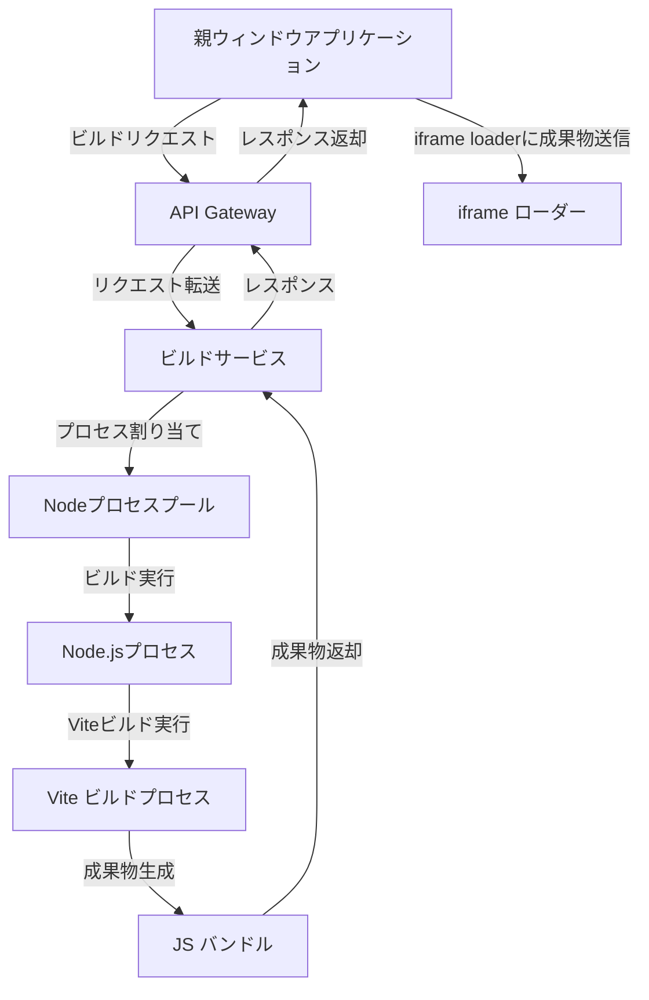
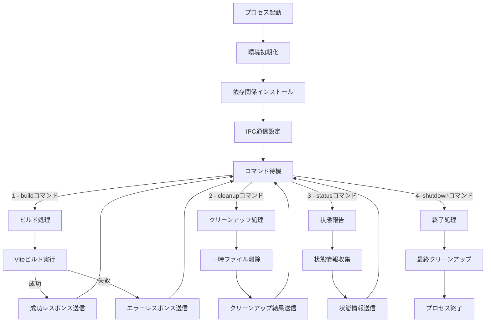
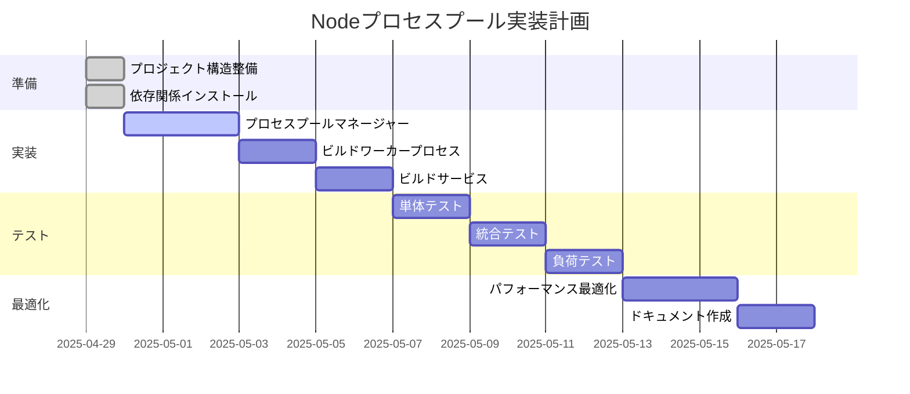

# Node プロセスプール方式 仕様書

## 1. 概要

本仕様書は、オンデマンドビルドサービスにおける Node プロセスプール方式の実装に関する詳細を定義します。この方式では、事前に複数の Node.js プロセスを起動し、それらを再利用可能な状態で管理することで、ビルドプロセスを高速化します。

### 1.1 目的

- ビルド時間の大幅な短縮（目標: 30-60 秒 → 3-5 秒）
- システムリソースの効率的な利用
- 同時ビルドリクエスト処理能力の向上
- コンテナ起動オーバーヘッドの排除

### 1.2 アプローチ

Docker コンテナの代わりに、Node.js の子プロセスを使用してビルド環境を提供します。各プロセスは事前に依存関係をインストール済みで、即時ビルド可能な状態を維持します。

## 2. システムアーキテクチャ



### 2.1 コンポーネント構成

| コンポーネント                 | 役割                                                     |
| ------------------------------ | -------------------------------------------------------- |
| **ビルドサービス**             | ビルドリクエストの受付、プロセスプールの管理、結果の返却 |
| **プロセスプールマネージャー** | Node.js プロセスの作成、管理、割り当て、監視             |
| **ビルドワーカープロセス**     | 実際の Vite ビルドを実行する Node.js プロセス            |
| **プロセス間通信 (IPC)**       | プロセス間でのコマンドとデータの送受信                   |
| **リソースモニター**           | プロセスのリソース使用状況の監視                         |

## 3. プロセスプールマネージャー詳細設計

### 3.1 プロセス管理

````mermaid
flowchart TD
    Init[サーバー初期化] --> CreatePool[プロセスプール作成]
    CreatePool --> StartProcesses[複数のNode.jsプロセスを起動]
    StartProcesses --> SetupIPC[IPC通信の確立]
    SetupIPC --> WaitRequests[リクエスト待機]

    WaitRequests --> |ビルドリクエスト| AssignProcess[プロセス割り当て]
    AssignProcess --> SendBuildCommand[ビルドコマンド送信]
    SendBuildCommand --> WaitResult[結果待機]
    WaitResult --> |成功| ReturnResult[結果返却]
    WaitResult --> |失敗| HandleError[エラー処理]
    ReturnResult --> ReleaseProcess[プロセス返却]
    HandleError --> ReleaseProcess
    ReleaseProcess --> WaitRequests

    subgraph "定期的な監視"
        Monitor[プロセス監視] --> CheckHealth[ヘルスチェック]
        CheckHealth --> |問題あり| RecycleProcess[プロセス再作成]
        CheckHealth --> |問題なし| ContinueMonitor[監視継続]
        Monitor --> CheckMemory[メモリ使用量確認]
        CheckMemory --> |閾値超過| RecycleProcess
    end
### 3.2 プロセス情報管理

各プロセスは以下の情報を持ちます：

```typescript
interface ProcessInfo {
  id: string;           // プロセス識別子
  process: ChildProcess; // Node.js子プロセスオブジェクト
  busy: boolean;        // 使用中フラグ
  lastUsed: Date;       // 最終使用時刻
  createdAt: Date;      // 作成時刻
  buildCount: number;   // 処理したビルド数
  memoryUsage?: number; // メモリ使用量 (MB)
}
````

### 3.3 プロセス間通信 (IPC)

メインプロセスとワーカープロセス間の通信は、Node.js の標準 IPC 機能を使用します：

1. **コマンド形式**:

   ```typescript
   interface IPCCommand {
     type: "build" | "cleanup" | "status" | "shutdown";
     payload?: any;
     requestId?: string;
   }
   ```

2. **レスポンス形式**:

   ```typescript
   interface IPCResponse {
     success: boolean;
     requestId?: string;
     result?: any;
     error?: string;
   }
   ```

3. **主要コマンド**:
   - `build`: ビルドの実行を指示
   - `cleanup`: 一時ファイルのクリーンアップを指示
   - `status`: プロセスの状態を取得
   - `shutdown`: プロセスの終了を指示

## 4. ビルドワーカープロセス詳細設計

### 4.1 ワーカープロセスの構造



### 4.2 ワーカープロセスの初期化

ワーカープロセスは起動時に以下の初期化を行います：

1. 作業ディレクトリの作成
2. 依存関係のインストール（または事前インストール済みの確認）
3. Vite 設定ファイルの準備
4. IPC 通信の確立
5. メモリ使用量の定期的な監視設定

### 4.3 ビルド処理フロー

1. ソースコードと設定の受信
2. 一時ファイルへの書き出し
3. Vite ビルドの実行
4. 成果物の読み取り
5. 結果の返却
6. 一時ファイルのクリーンアップ

## 5. API 設計

### 5.1 プロセスプールマネージャー API

```typescript
class NodeProcessPoolManager {
  /**
   * プロセスプールを初期化
   * @param poolSize プールサイズ
   * @param options 追加設定オプション
   */
  async initialize(poolSize: number, options?: PoolOptions): Promise<void>;

  /**
   * 利用可能なプロセスを取得
   * @returns プロセス情報
   */
  async getAvailableProcess(): Promise<ProcessInfo>;

  /**
   * プロセスを返却（解放）
   * @param processId プロセスID
   */
  releaseProcess(processId: string): void;

  /**
   * プロセスでビルドを実行
   * @param processId プロセスID
   * @param buildParams ビルドパラメータ
   * @returns ビルド結果
   */
  async executeBuild(
    processId: string,
    buildParams: BuildParams
  ): Promise<BuildResult>;

  /**
   * プロセスの状態を取得
   * @param processId プロセスID
   * @returns プロセス状態情報
   */
  async getProcessStatus(processId: string): Promise<ProcessStatus>;

  /**
   * プールの状態を取得
   * @returns プール状態情報
   */
  getPoolStats(): PoolStats;

  /**
   * プロセスプールをシャットダウン
   */
  async shutdown(): Promise<void>;
}
```

### 5.2 ビルドサービス API

```typescript
class NodeProcessBuildService {
  /**
   * ソースコードをビルド
   * @param sourceCode ソースコード
   * @param options ビルドオプション
   * @returns ビルド結果
   */
  async buildArtifact(
    sourceCode: string,
    options?: BuildOptions
  ): Promise<BuildResult>;

  /**
   * ビルドサービスの状態を取得
   * @returns サービス状態情報
   */
  getServiceStats(): ServiceStats;
}
```

## 6. データ構造

### 6.1 設定オプション

```typescript
interface PoolOptions {
  maxIdleTime?: number; // 最大アイドル時間 (ms)
  maxProcessAge?: number; // プロセス最大寿命 (ms)
  maxMemoryUsage?: number; // 最大メモリ使用量 (MB)
  healthCheckInterval?: number; // ヘルスチェック間隔 (ms)
  workDir?: string; // 作業ディレクトリ
  logLevel?: string; // ログレベル
}

interface BuildOptions {
  dependencies?: Record<string, string>; // 追加の依存関係
  viteConfig?: any; // Vite設定のカスタマイズ
  timeout?: number; // ビルドタイムアウト (ms)
}
```

### 6.2 ビルド結果

```typescript
interface BuildResult {
  success: boolean;
  artifact?: {
    type: string; // 成果物の種類 (jsBundle など)
    content: string; // 成果物の内容
  };
  buildInfo?: {
    duration: number; // ビルド所要時間 (ms)
    timestamp: string; // ビルド完了時刻
    processId: string; // ビルドを実行したプロセスID
  };
  error?: string; // エラーメッセージ
  errorType?: string; // エラー種別
  details?: any; // 詳細情報
}
```

### 6.3 プール状態情報

```typescript
interface PoolStats {
  total: number; // 総プロセス数
  busy: number; // 使用中プロセス数
  available: number; // 利用可能プロセス数
  recycleCount: number; // 再作成したプロセス数
  totalBuilds: number; // 総ビルド実行数
  avgBuildTime: number; // 平均ビルド時間 (ms)
  memoryUsage: number; // 総メモリ使用量 (MB)
}
```

## 7. 実装詳細

### 7.1 プロセスプールマネージャーの実装例

```typescript
// src/process/nodeProcessPoolManager.ts
import { ChildProcess, fork } from "child_process";
import { v4 as uuidv4 } from "uuid";
import path from "path";
import { logger } from "../utils/logger";

interface ProcessInfo {
  id: string;
  process: ChildProcess;
  busy: boolean;
  lastUsed: Date;
  createdAt: Date;
  buildCount: number;
  memoryUsage?: number;
}

interface PoolOptions {
  maxIdleTime?: number;
  maxProcessAge?: number;
  maxMemoryUsage?: number;
  healthCheckInterval?: number;
  workDir?: string;
  logLevel?: string;
}

interface BuildParams {
  sourceCode: string;
  options?: any;
}

interface BuildResult {
  success: boolean;
  artifact?: {
    type: string;
    content: string;
  };
  error?: string;
  errorType?: string;
  details?: any;
}

interface IPCCommand {
  type: "build" | "cleanup" | "status" | "shutdown";
  payload?: any;
  requestId?: string;
}

interface IPCResponse {
  success: boolean;
  requestId?: string;
  result?: any;
  error?: string;
}

export class NodeProcessPoolManager {
  private processes: ProcessInfo[] = [];
  private readonly poolSize: number;
  private readonly maxIdleTime: number;
  private readonly maxProcessAge: number;
  private readonly maxMemoryUsage: number;
  private readonly healthCheckInterval: number;
  private readonly workDir: string;
  private recycleCount: number = 0;
  private totalBuilds: number = 0;
  private totalBuildTime: number = 0;

  constructor(poolSize = 3, options: PoolOptions = {}) {
    this.poolSize = poolSize;
    this.maxIdleTime = options.maxIdleTime || 300000; // 5分
    this.maxProcessAge = options.maxProcessAge || 3600000; // 1時間
    this.maxMemoryUsage = options.maxMemoryUsage || 500; // 500MB
    this.healthCheckInterval = options.healthCheckInterval || 60000; // 1分
    this.workDir = options.workDir || path.resolve("./tmp/process-pool");
  }

  async initialize(): Promise<void> {
    logger.info(`Nodeプロセスプールを初期化（サイズ: ${this.poolSize}）`);

    // 作業ディレクトリの作成
    // ...

    // プロセスの起動
    for (let i = 0; i < this.poolSize; i++) {
      try {
        const processInfo = await this.startProcess();
        this.processes.push(processInfo);
        logger.info(`プロセス起動成功: ${processInfo.id}`);
      } catch (error) {
        logger.error(`プロセス起動エラー: ${error}`);
      }
    }

    // 定期的な監視タスクを開始
    setInterval(() => this.monitorProcesses(), this.healthCheckInterval);
    setInterval(() => this.cleanupIdleProcesses(), 60000);
  }

  private async startProcess(): Promise<ProcessInfo> {
    const processId = uuidv4();
    const workDir = path.join(this.workDir, processId);

    // 子プロセスの起動
    const childProcess = fork(path.resolve(__dirname, "./buildWorker.js"), [], {
      stdio: ["pipe", "pipe", "pipe", "ipc"],
      env: {
        ...process.env,
        PROCESS_ID: processId,
        WORK_DIR: workDir,
        LOG_LEVEL: "info",
      },
    });

    // プロセス情報の作成
    const processInfo: ProcessInfo = {
      id: processId,
      process: childProcess,
      busy: false,
      lastUsed: new Date(),
      createdAt: new Date(),
      buildCount: 0,
    };

    // 初期化完了を待機
    await this.waitForProcessReady(childProcess);

    return processInfo;
  }

  private waitForProcessReady(childProcess: ChildProcess): Promise<void> {
    return new Promise((resolve, reject) => {
      const timeout = setTimeout(() => {
        reject(new Error("プロセス初期化タイムアウト"));
      }, 30000);

      const messageHandler = (message: any) => {
        if (message && message.type === "ready") {
          clearTimeout(timeout);
          childProcess.removeListener("message", messageHandler);
          resolve();
        }
      };

      childProcess.on("message", messageHandler);
      childProcess.on("error", (err) => {
        clearTimeout(timeout);
        childProcess.removeListener("message", messageHandler);
        reject(err);
      });

      childProcess.on("exit", (code) => {
        if (code !== 0) {
          clearTimeout(timeout);
          childProcess.removeListener("message", messageHandler);
          reject(new Error(`プロセスが異常終了しました (コード: ${code})`));
        }
      });
    });
  }

  async getAvailableProcess(): Promise<ProcessInfo> {
    // 利用可能なプロセスを探す
    const availableProcess = this.processes.find((p) => !p.busy);

    if (availableProcess) {
      availableProcess.busy = true;
      availableProcess.lastUsed = new Date();
      return availableProcess;
    }

    // 利用可能なプロセスがない場合は新しいプロセスを作成
    try {
      const processInfo = await this.startProcess();
      processInfo.busy = true;
      this.processes.push(processInfo);
      return processInfo;
    } catch (error) {
      logger.error(`新規プロセス起動エラー: ${error}`);
      throw new Error("利用可能なプロセスがありません");
    }
  }

  releaseProcess(processId: string): void {
    const processInfo = this.processes.find((p) => p.id === processId);
    if (processInfo) {
      processInfo.busy = false;
      processInfo.lastUsed = new Date();
    }
  }

  async executeBuild(
    processId: string,
    buildParams: BuildParams
  ): Promise<BuildResult> {
    const processInfo = this.processes.find((p) => p.id === processId);
    if (!processInfo) {
      throw new Error(`プロセスが見つかりません: ${processId}`);
    }

    const startTime = Date.now();

    try {
      const result = await this.sendCommand(processInfo.process, {
        type: "build",
        payload: buildParams,
        requestId: uuidv4(),
      });

      const buildTime = Date.now() - startTime;
      this.totalBuilds++;
      this.totalBuildTime += buildTime;
      processInfo.buildCount++;

      return result.result;
    } catch (error) {
      logger.error(`ビルド実行エラー: ${error}`);
      return {
        success: false,
        error: error instanceof Error ? error.message : String(error),
        errorType: "PROCESS_ERROR",
      };
    }
  }

  private sendCommand(
    process: ChildProcess,
    command: IPCCommand
  ): Promise<IPCResponse> {
    return new Promise((resolve, reject) => {
      const timeout = setTimeout(() => {
        reject(new Error("コマンド実行タイムアウト"));
      }, 60000);

      const messageHandler = (message: any) => {
        if (message && message.requestId === command.requestId) {
          clearTimeout(timeout);
          process.removeListener("message", messageHandler);

          if (message.success) {
            resolve(message);
          } else {
            reject(new Error(message.error || "コマンド実行エラー"));
          }
        }
      };

      process.on("message", messageHandler);
      process.send(command);
    });
  }

  private async monitorProcesses(): Promise<void> {
    logger.debug("プロセスの状態監視を実行中...");

    for (const processInfo of this.processes) {
      try {
        // プロセスが生きているか確認
        if (!processInfo.process || !processInfo.process.connected) {
          logger.warn(`プロセスが接続されていません: ${processInfo.id}`);
          await this.recycleProcess(processInfo);
          continue;
        }

        // メモリ使用量の確認
        const status = await this.getProcessStatus(processInfo.id);
        processInfo.memoryUsage = status.memoryUsage;

        if (status.memoryUsage > this.maxMemoryUsage) {
          logger.warn(
            `プロセスのメモリ使用量が閾値を超えています: ${processInfo.id} (${status.memoryUsage}MB)`
          );
          await this.recycleProcess(processInfo);
          continue;
        }

        // プロセスの年齢確認
        const processAge =
          new Date().getTime() - processInfo.createdAt.getTime();
        if (processAge > this.maxProcessAge) {
          logger.info(`プロセスの最大稼働時間を超えました: ${processInfo.id}`);
          await this.recycleProcess(processInfo);
          continue;
        }
      } catch (error) {
        logger.error(`プロセス監視中にエラーが発生: ${processInfo.id}`, error);
      }
    }
  }

  private async cleanupIdleProcesses(): Promise<void> {
    const now = new Date();
    const processesToRemove: ProcessInfo[] = [];

    // アイドル状態が長いプロセスを特定
    this.processes.forEach((processInfo) => {
      if (
        !processInfo.busy &&
        now.getTime() - processInfo.lastUsed.getTime() > this.maxIdleTime
      ) {
        processesToRemove.push(processInfo);
      }
    });

    // 最低限のプロセス数は維持
    const minProcessesToKeep = Math.max(1, this.poolSize / 2);
    if (this.processes.length - processesToRemove.length < minProcessesToKeep) {
      // 最も最近使用されたものから削除対象を減らす
      processesToRemove.sort(
        (a, b) => a.lastUsed.getTime() - b.lastUsed.getTime()
      );
      processesToRemove.splice(
        processesToRemove.length - (this.processes.length - minProcessesToKeep)
      );
    }

    // 不要なプロセスを停止
    for (const processInfo of processesToRemove) {
      try {
        await this.stopProcess(processInfo);
        this.processes = this.processes.filter((p) => p.id !== processInfo.id);
        logger.info(`アイドルプロセスを停止: ${processInfo.id}`);
      } catch (error) {
        logger.error(`プロセス停止エラー: ${error}`);
      }
    }
  }

  private async recycleProcess(processInfo: ProcessInfo): Promise<void> {
    try {
      // プロセスが使用中でない場合のみリサイクル
      if (!processInfo.busy) {
        await this.stopProcess(processInfo);
        this.processes = this.processes.filter((p) => p.id !== processInfo.id);

        // 新しいプロセスを作成
        const newProcessInfo = await this.startProcess();
        this.processes.push(newProcessInfo);
        this.recycleCount++;
        logger.info(
          `プロセスをリサイクルしました: ${processInfo.id} -> ${newProcessInfo.id}`
        );
      }
    } catch (error) {
      logger.error(
        `プロセスリサイクル中にエラーが発生: ${processInfo.id}`,
        error
      );
    }
  }

  private async stopProcess(processInfo: ProcessInfo): Promise<void> {
    try {
      // シャットダウンコマンドを送信
      await this.sendCommand(processInfo.process, {
        type: "shutdown",
        requestId: uuidv4(),
      });
    } catch (error) {
      logger.warn(`シャットダウンコマンド送信エラー: ${error}`);
    }

    return new Promise<void>((resolve) => {
      // 正常終了を待機
      const exitHandler = () => {
        processInfo.process.removeListener("exit", exitHandler);
        resolve();
      };

      processInfo.process.on("exit", exitHandler);

      // 強制終了のタイムアウト設定
      setTimeout(() => {
        if (processInfo.process.connected) {
          processInfo.process.kill("SIGTERM");
          logger.warn(`プロセスを強制終了: ${processInfo.id}`);
        }
      }, 5000);

      // シャットダウンリクエスト
      processInfo.process.disconnect();
    });
  }

  async getProcessStatus(processId: string): Promise<any> {
    const processInfo = this.processes.find((p) => p.id === processId);
    if (!processInfo) {
      throw new Error(`プロセスが見つかりません: ${processId}`);
    }

    try {
      const response = await this.sendCommand(processInfo.process, {
        type: "status",
        requestId: uuidv4(),
      });

      return response.result;
    } catch (error) {
      logger.error(`状態取得エラー: ${error}`);
      throw error;
    }
  }

  getPoolStats() {
    const total = this.processes.length;
    const busy = this.processes.filter((p) => p.busy).length;
    const avgBuildTime =
      this.totalBuilds > 0 ? this.totalBuildTime / this.totalBuilds : 0;

    const totalMemory = this.processes.reduce(
      (sum, p) => sum + (p.memoryUsage || 0),
      0
    );

    return {
      total,
      busy,
      available: total - busy,
      recycleCount: this.recycleCount,
      totalBuilds: this.totalBuilds,
      avgBuildTime,
      memoryUsage: totalMemory,
    };
  }

  async shutdown(): Promise<void> {
    logger.info("プロセスプールをシャットダウンしています...");

    const shutdownPromises = this.processes.map((processInfo) =>
      this.stopProcess(processInfo)
    );

    await Promise.all(shutdownPromises);
    this.processes = [];

    logger.info("プロセスプールのシャットダウンが完了しました");
  }
}

export const nodeProcessPoolManager = new NodeProcessPoolManager();
```

### 7.2 ビルドワーカープロセスの実装例

```typescript
// src/process/buildWorker.ts
import path from "path";
import fs from "fs/promises";
import { execFile } from "child_process";
import { promisify } from "util";
import { cpus, freemem, totalmem } from "os";

const execFileAsync = promisify(execFile);

// プロセス情報
const processId = process.env.PROCESS_ID || "unknown";
const workDir =
  process.env.WORK_DIR || path.resolve(`./tmp/worker-${processId}`);
const logLevel = process.env.LOG_LEVEL || "info";

// 状態管理
let buildCount = 0;
let lastBuildTime = 0;
let isShuttingDown = false;

// 初期化
async function initialize() {
  try {
    console.log(`[Worker ${processId}] 初期化を開始します...`);

    // 作業ディレクトリの作成
    await fs.mkdir(workDir, { recursive: true });
    await fs.mkdir(path.join(workDir, "src"), { recursive: true });
    await fs.mkdir(path.join(workDir, "dist"), { recursive: true });

    // 設定ファイルの作成
    await createConfigFiles();

    // 依存関係のインストール（または確認）
    await ensureDependencies();

    // メモリ使用量の定期的な監視
    setInterval(reportMemoryUsage, 30000);

    // 準備完了を通知
    process.send?.({ type: "ready" });

    console.log(`[Worker ${processId}] 初期化完了`);
  } catch (error) {
    console.error(`[Worker ${processId}] 初期化エラー:`, error);
    process.exit(1);
  }
}

// 設定ファイルの作成
async function createConfigFiles() {
  // package.json
  const packageJson = {
    name: `build-worker-${processId}`,
    private: true,
    version: "0.0.0",
    type: "module",
    scripts: {
      build: "vite build",
    },
    dependencies: {
      react: "^18.2.0",
      "react-dom": "^18.2.0",
    },
    devDependencies: {
      "@vitejs/plugin-react": "^4.0.0",
      vite: "^4.3.9",
    },
  };

  // vite.config.js
  const viteConfig = `
import { defineConfig } from 'vite';
import react from '@vitejs/plugin-react';

export default defineConfig({
  plugins: [react()],
  build: {
    outDir: 'dist',
    emptyOutDir: true,
    minify: true,
    lib: {
      entry: 'src/main.jsx',
      formats: ['iife'],
      name: 'ArtifactApp',
      fileName: 'artifact'
    },
    rollupOptions: {
      external: [],
      output: {
        globals: {}
      }
    }
  },
  optimizeDeps: {
    disabled: true
  }
});
  `;

  // index.html
  const indexHtml = `
<!DOCTYPE html>
<html lang="en">
  <head>
    <meta charset="UTF-8" />
    <meta name="viewport" content="width=device-width, initial-scale=1.0" />
    <title>Artifact Preview</title>
  </head>
  <body>
    <div id="root"></div>
    <script type="module" src="/src/main.jsx"></script>
  </body>
</html>
  `;

  await fs.writeFile(
    path.join(workDir, "package.json"),
    JSON.stringify(packageJson, null, 2)
  );
  await fs.writeFile(path.join(workDir, "vite.config.js"), viteConfig);
  await fs.writeFile(path.join(workDir, "index.html"), indexHtml);
}

// 依存関係のインストール確認
async function ensureDependencies() {
  try {
    // node_modules が存在するか確認
    const nodeModulesPath = path.join(workDir, "node_modules");
    const exists = await fs
      .access(nodeModulesPath)
      .then(() => true)
      .catch(() => false);

    if (!exists) {
      console.log(`[Worker ${processId}] 依存関係をインストールします...`);

      // npm install の実行
      await execFileAsync("npm", ["install", "--silent"], {
        cwd: workDir,
        timeout: 300000, // 5分
      });

      console.log(`[Worker ${processId}] 依存関係のインストールが完了しました`);
    } else {
      console.log(`[Worker ${processId}] 依存関係は既にインストール済みです`);
    }
  } catch (error) {
    console.error(
      `[Worker ${processId}] 依存関係のインストールに失敗しました:`,
      error
    );
    throw error;
  }
}

// ビルドの実行
async function executeBuild(buildParams) {
  const { sourceCode, options = {} } = buildParams;
  const startTime = Date.now();

  try {
    console.log(`[Worker ${processId}] ビルドを開始します...`);

    // ソースコードの保存
    await fs.writeFile(path.join(workDir, "src", "main.jsx"), sourceCode);

    // Vite設定のカスタマイズ（オプション）
    if (options.viteConfig) {
      // ...
    }

    // ビルドの実行
    await execFileAsync("npx", ["vite", "build"], {
      cwd: workDir,
      timeout: options.timeout || 60000, // デフォルト1分
    });

    // 成果物の読み取り
    const artifactPath = path.join(workDir, "dist", "artifact.iife.js");
    const artifactContent = await fs.readFile(artifactPath, "utf-8");

    // 統計情報の更新
    buildCount++;
    lastBuildTime = Date.now() - startTime;

    console.log(
      `[Worker ${processId}] ビルドが完了しました (${lastBuildTime}ms)`
    );

    return {
      success: true,
      artifact: {
        type: "jsBundle",
        content: artifactContent,
      },
      buildInfo: {
        duration: lastBuildTime,
        timestamp: new Date().toISOString(),
      },
    };
  } catch (error) {
    console.error(`[Worker ${processId}] ビルドエラー:`, error);

    return {
      success: false,
      error: error.message || "ビルド中にエラーが発生しました",
      errorType: "BUILD_ERROR",
      details: error.stderr || error.toString(),
    };
  }
}

// クリーンアップ処理
async function cleanup() {
  try {
    console.log(`[Worker ${processId}] クリーンアップを実行します...`);

    // 一時ファイルの削除
    await fs.rm(path.join(workDir, "src", "main.jsx"), { force: true });
    await fs.rm(path.join(workDir, "dist"), { recursive: true, force: true });
    await fs.mkdir(path.join(workDir, "dist"), { recursive: true });

    return { success: true };
  } catch (error) {
    console.error(`[Worker ${processId}] クリーンアップエラー:`, error);
    return {
      success: false,
      error: error.message || "クリーンアップ中にエラーが発生しました",
    };
  }
}

// 状態情報の取得
function getStatus() {
  const memoryUsage = process.memoryUsage();
  const systemMemory = {
    free: freemem() / 1024 / 1024,
    total: totalmem() / 1024 / 1024,
  };

  return {
    processId,
    uptime: process.uptime(),
    buildCount,
    lastBuildTime,
    memoryUsage: Math.round(memoryUsage.rss / 1024 / 1024), // MB単位
    heapUsage: Math.round(memoryUsage.heapUsed / 1024 / 1024),
    systemMemory,
  };
}

// メモリ使用量の報告
function reportMemoryUsage() {
  const status = getStatus();
  console.log(
    `[Worker ${processId}] メモリ使用量: ${status.memoryUsage}MB, ヒープ: ${status.heapUsage}MB`
  );
}

// シャットダウン処理
async function shutdown() {
  if (isShuttingDown) return;
  isShuttingDown = true;

  console.log(`[Worker ${processId}] シャットダウンを開始します...`);

  try {
    // 最終クリーンアップ
    await cleanup();

    console.log(`[Worker ${processId}] シャットダウンが完了しました`);
    process.exit(0);
  } catch (error) {
    console.error(`[Worker ${processId}] シャットダウンエラー:`, error);
    process.exit(1);
  }
}

// メッセージハンドラの設定
process.on("message", async (message) => {
  if (!message || !message.type) return;

  const { type, payload, requestId } = message;

  try {
    let result;

    switch (type) {
      case "build":
        result = await executeBuild(payload);
        break;

      case "cleanup":
        result = await cleanup();
        break;

      case "status":
        result = getStatus();
        break;

      case "shutdown":
        result = { success: true };
        process.send?.({ success: true, requestId, result });
        await shutdown();
        return;

      default:
        throw new Error(`不明なコマンドタイプ: ${type}`);
    }

    process.send?.({ success: true, requestId, result });
  } catch (error) {
    console.error(`[Worker ${processId}] コマンド処理エラー:`, error);
    process.send?.({
      success: false,
      requestId,
      error: error.message || "コマンド処理中にエラーが発生しました",
    });
  }
});

// 終了シグナルのハンドリング
process.on("SIGTERM", shutdown);
process.on("SIGINT", shutdown);

// 未処理の例外ハンドリング
process.on("uncaughtException", (error) => {
  console.error(`[Worker ${processId}] 未処理の例外:`, error);
  process.exit(1);
});

// 初期化の実行
initialize().catch((error) => {
  console.error(`[Worker ${processId}] 初期化に失敗しました:`, error);
  process.exit(1);
});
```

### 7.3 ビルドサービスの実装例

```typescript
// src/build/nodeProcessBuildService.ts
import { nodeProcessPoolManager } from "../process/nodeProcessPoolManager";
import { logger } from "../utils/logger";

interface BuildOptions {
  dependencies?: Record<string, string>;
  viteConfig?: any;
  timeout?: number;
}

interface BuildResult {
  success: boolean;
  artifact?: {
    type: string;
    content: string;
  };
  buildInfo?: {
    duration: number;
    timestamp: string;
    processId?: string;
  };
  error?: string;
  errorType?: string;
  details?: any;
}

export class NodeProcessBuildService {
  constructor() {
    // 初期化は外部から行う
  }

  async buildArtifact(
    sourceCode: string,
    options?: BuildOptions
  ): Promise<BuildResult> {
    logger.info("ビルドリクエストを受信しました");

    const startTime = Date.now();

    try {
      // 入力検証
      if (!sourceCode || typeof sourceCode !== "string") {
        return {
          success: false,
          error: "ソースコードが提供されていないか、無効な形式です",
          errorType: "VALIDATION_ERROR",
        };
      }

      // プロセスの取得
      const processInfo = await nodeProcessPoolManager.getAvailableProcess();
      logger.info(`プロセスを割り当てました: ${processInfo.id}`);

      try {
        // ビルドの実行
        const result = await nodeProcessPoolManager.executeBuild(
          processInfo.id,
          { sourceCode, options }
        );

        // ビルド情報の追加
        if (result.success && result.buildInfo) {
          result.buildInfo.processId = processInfo.id;
        }

        return result;
      } finally {
        // プロセスの返却
        nodeProcessPoolManager.releaseProcess(processInfo.id);
        logger.info(`プロセスを返却しました: ${processInfo.id}`);
      }
    } catch (error) {
      logger.error("ビルド処理中にエラーが発生しました", error);

      const buildTime = Date.now() - startTime;
      return {
        success: false,
        error: error instanceof Error ? error.message : String(error),
        errorType: "SYSTEM_ERROR",
        buildInfo: {
          duration: buildTime,
          timestamp: new Date().toISOString(),
        },
      };
    }
  }

  getServiceStats() {
    const poolStats = nodeProcessPoolManager.getPoolStats();

    return {
      ...poolStats,
      serviceUptime: process.uptime(),
      timestamp: new Date().toISOString(),
    };
  }
}

export const nodeProcessBuildService = new NodeProcessBuildService();
```

## 8. 実装計画

### 8.1 実装ステップ

1. **基本構造の実装**

   - プロジェクト構造の整備
   - 必要なパッケージのインストール
   - TypeScript 設定の構成

2. **プロセスプールマネージャーの実装**

   - 基本的なプロセス管理機能の実装
   - IPC 通信の実装
   - プロセス監視機能の実装

3. **ビルドワーカープロセスの実装**

   - 初期化処理の実装
   - ビルド処理の実装
   - クリーンアップ処理の実装

4. **ビルドサービスの実装**

   - プロセスプールとの連携
   - エラーハンドリングの実装
   - API 統合

5. **テストと最適化**
   - 単体テストの実装
   - 負荷テストの実施
   - パフォーマンス最適化

### 8.2 タイムライン



## 9. コンテナプール方式との比較

### 9.1 パフォーマンス比較

| 指標             | コンテナプール方式 | Node プロセスプール方式 |
| ---------------- | ------------------ | ----------------------- |
| ビルド時間       | 5-10 秒            | 3-5 秒                  |
| メモリ使用量     | 中〜高             | 低〜中                  |
| CPU 使用率       | 中                 | 低                      |
| 起動時間         | 中                 | 低                      |
| スケーラビリティ | 高                 | 中                      |

### 9.2 セキュリティ比較

| 側面                 | コンテナプール方式  | Node プロセスプール方式 |
| -------------------- | ------------------- | ----------------------- |
| 隔離レベル           | 高 (コンテナレベル) | 中 (プロセスレベル)     |
| リソース制限         | 細かく設定可能      | 限定的                  |
| ファイルシステム隔離 | 高                  | 中                      |
| ネットワーク隔離     | 高                  | 低                      |
| 権限管理             | 詳細に設定可能      | 限定的                  |

### 9.3 運用比較

| 側面           | コンテナプール方式 | Node プロセスプール方式 |
| -------------- | ------------------ | ----------------------- |
| 実装複雑性     | 高                 | 中                      |
| 依存関係       | Docker 必須        | Node.js のみ            |
| 監視容易性     | 中                 | 高                      |
| デバッグ容易性 | 低                 | 高                      |
| 環境依存性     | 低                 | 中                      |

## 10. まとめ

Node プロセスプール方式は、コンテナプール方式と比較して以下の特徴があります：

- **高速性**: コンテナ起動オーバーヘッドがなく、より高速なビルド処理が可能
- **リソース効率**: 軽量なプロセスを使用するため、リソース使用量が少ない
- **実装容易性**: Docker に依存せず、Node.js のみで実装可能
- **デバッグ容易性**: プロセス間通信が直接的で、デバッグが容易

一方で、以下の制約があります：

- **隔離レベルの低下**: コンテナよりも隔離レベルが低く、セキュリティリスクが高まる
- **リソース制限の制約**: コンテナほど細かいリソース制限が設定できない
- **環境依存性**: ホスト OS の環境に依存するため、再現性が低下する

適切なユースケースは以下の通りです：

- 信頼できるソースコードのビルド
- 高速なビルド処理が必要な場合
- Docker 環境が利用できない環境
- 開発環境や内部向けサービス

セキュリティが最優先される場合や、完全な隔離が必要な場合は、コンテナプール方式の方が適しています。
