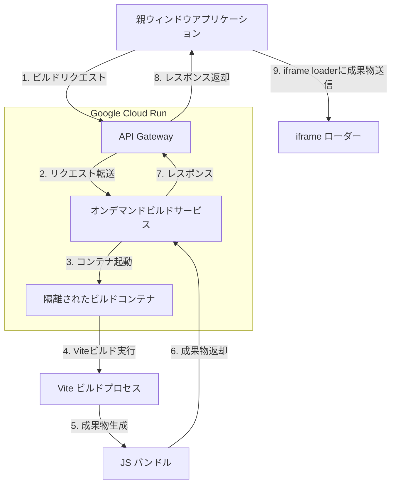
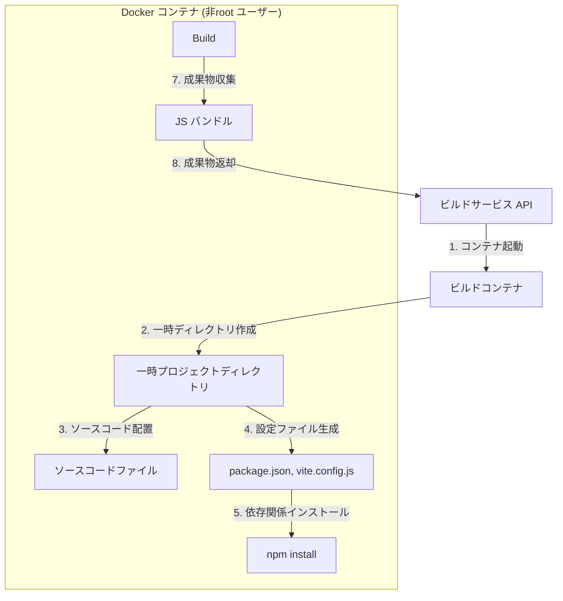
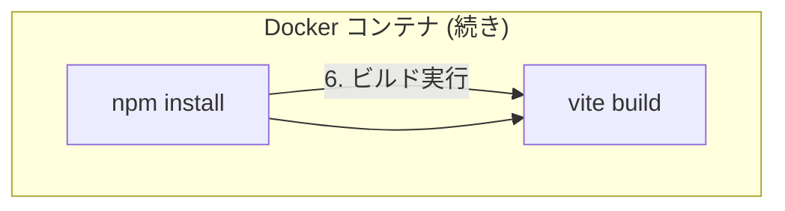
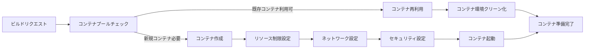
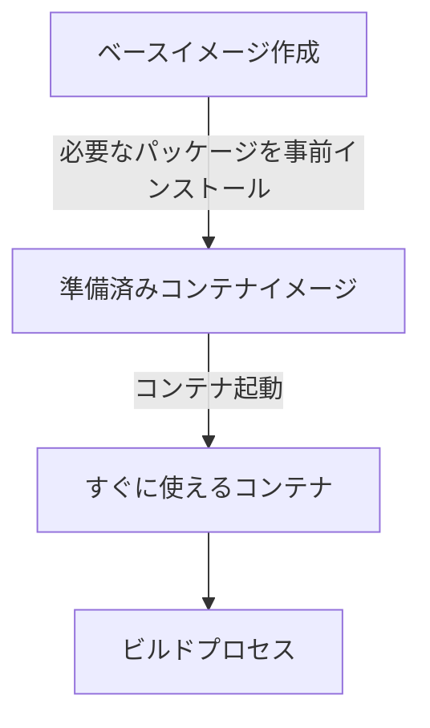
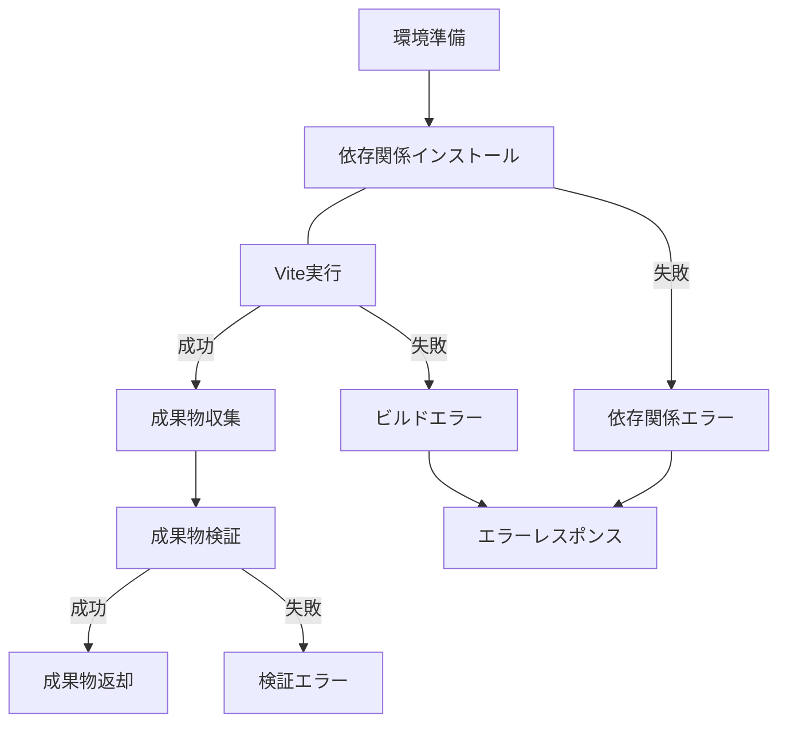
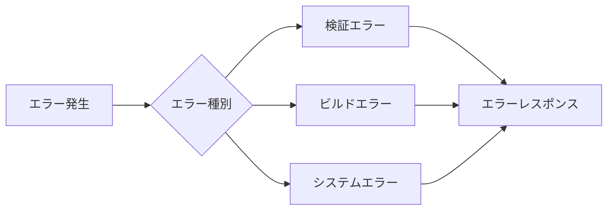
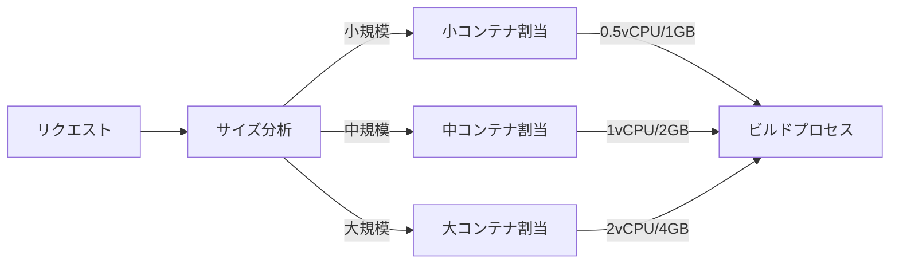
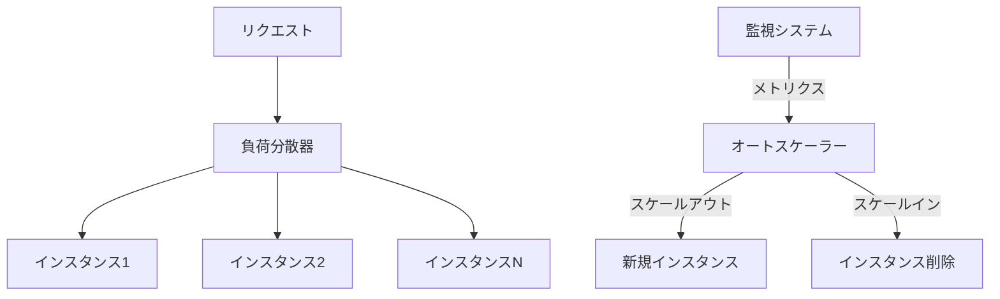
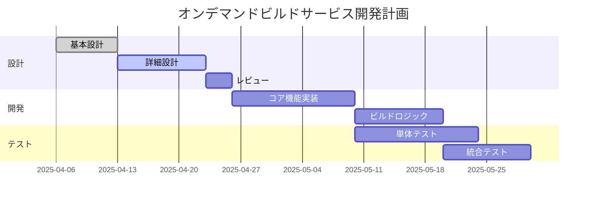

# オンデマンドビルドサービス詳細設計書

## 1. システム概要

オンデマンドビルドサービスは、ユーザー提供または LLM 生成によるソースコード（主に Web フロントエンド技術）を安全な環境でビルドし、その実行結果を親アプリケーション内の `<iframe>` に動的に表示するシステムの一部です。このサービスは、受け取ったソースコードを Vite を用いてビルドし、ブラウザで直接実行可能な JavaScript バンドルを生成して返却します。

## 2. アーキテクチャ設計

### 2.1 全体アーキテクチャ



### 2.2 コンテナアーキテクチャ





## 3. API 設計

### 3.1 エンドポイント

**URL**: `/api/build-artifact`  
**メソッド**: POST  
**コンテンツタイプ**: application/json

### 3.2 リクエスト仕様

```json
{
  "sourceCode": "..." // ビルド対象のソースコード文字列 (必須)
}

// 注: 依存関係とVite設定は事前に環境に設定済みのものを使用
// 追加の依存関係が必要な場合は事前にコンテナイメージに組み込む
```

### 3.3 レスポンス仕様

**成功時 (200 OK)**:

```json
{
  "success": true,
  "artifact": {
    "type": "jsBundle", // 成果物の種類
    "content": "..." // ビルドされたJavaScriptコードの文字列
  },
  "buildInfo": {
    "duration": 1234, // ビルド所要時間（ミリ秒）
    "timestamp": "2025-04-06T10:30:00Z" // ビルド完了時刻
  }
}
```

**失敗時 (400/500)**:

```json
{
  "success": false,
  "error": "エラーメッセージ詳細",
  "errorType": "BUILD_ERROR", // エラー種別（VALIDATION_ERROR, BUILD_ERROR, SYSTEM_ERROR など）
  "details": { 
    // オプション: エラーの詳細情報（行番号、エラーコードなど）
  }
}
```

## 4. ビルドプロセス詳細

### 4.1 入力検証

1. リクエストボディの構造検証
   - `sourceCode` が文字列であり、かつ存在することを確認
   - コードサイズの上限チェック（例: 最大 500KB）
   
2. コード安全性の事前チェック
   - 危険な API 呼び出しやパターンのスキャン（オプション）
   - コードサイズの制限チェック（例: 最大 500KB）

### 4.2 コンテナ環境設定



#### 4.2.1 リソース制限

- **CPU**: 2 vCPU（最大）
- **メモリ**: 4 GB（最大）
- **実行時間**: 60秒（タイムアウト）
- **ディスク容量**: 一時ディレクトリに最大 1 GB
- **ネットワーク**: npm レジストリ（registry.npmjs.org）へのアクセスのみ許可

### 4.3 プロジェクト設定

1. 一時ディレクトリ構造

```
/tmp/build-{UUID}/
  ├── package.json
  ├── vite.config.js
  ├── index.html
  └── src/
      └── main.jsx (または適切な拡張子)
```

2. `package.json` テンプレート

```json
{
  "name": "artifact-build",
  "private": true,
  "version": "0.0.0",
  "type": "module",
  "scripts": {
    "build": "vite build"
  },
  "dependencies": {
    // 事前に決定された依存関係
    "react": "^18.2.0",
    "react-dom": "^18.2.0",
    // 他の必要なパッケージも事前に追加
  },
  "devDependencies": {
    "@vitejs/plugin-react": "^4.0.0",
    "vite": "^4.3.9"
  }
}
```

3. `vite.config.js` テンプレート

```javascript
import { defineConfig } from 'vite';
import react from '@vitejs/plugin-react';

export default defineConfig({
  plugins: [react()],
  build: {
    outDir: 'dist',
    emptyOutDir: true,
    minify: true,
    // ライブラリモードで単一のJSファイルを生成
    lib: {
      entry: 'src/main.jsx',
      formats: ['iife'],
      name: 'ArtifactApp',
      fileName: 'artifact'
    },
    rollupOptions: {
      // 外部依存関係の設定
      external: [],
      output: {
        globals: {}
      }
    }
  },
  // 他の事前設定されたVite設定
});
```

4. `index.html` テンプレート

```html
<!DOCTYPE html>
<html lang="en">
  <head>
    <meta charset="UTF-8" />
    <meta name="viewport" content="width=device-width, initial-scale=1.0" />
    <title>Artifact Preview</title>
  </head>
  <body>
    <div id="root"></div>
    <script type="module" src="/src/main.jsx"></script>
  </body>
</html>
```

### 4.4 依存関係管理

#### 4.4.1 事前インストール戦略



#### 4.4.2 イメージ管理戦略

- **ベースイメージ**: 全ての依存関係が事前インストールされた Docker イメージを準備
- **更新頻度**: 依存関係が変更される都度、または月次でイメージを更新
- **複数バージョン**: 異なるフレームワーク/ライブラリセットに対応するための複数イメージをオプションで提供
   - 例: React専用イメージ、Vue専用イメージなど
- **イメージレジストリ**: Google Container Registry で管理

### 4.5 ビルド実行



#### 4.5.1 コマンド実行シーケンス

1. `cd /tmp/build-{UUID}`
2. 依存関係は事前インストール済みのため、このステップは不要
3. `npx vite build`
4. 成果物ファイル（`dist/artifact.js`）の読み込み

### 4.6 エラーハンドリング

#### 4.6.1 エラー種別と対応

エラー種別と対応は以下の通りです：

- **VALIDATION_ERROR**: リクエスト検証エラー (HTTP 400 Bad Request) - エラー詳細を返却
- **DEPENDENCY_ERROR**: 依存関係解決エラー (HTTP 400 Bad Request) - npm エラーログを解析して返却
- **BUILD_ERROR**: Vite ビルドエラー (HTTP 400 Bad Request) - ビルドエラーログを解析して返却
- **RESOURCE_LIMIT_ERROR**: リソース制限超過 (HTTP 400 Bad Request) - どのリソースが制限を超えたか返却
- **TIMEOUT_ERROR**: 実行タイムアウト (HTTP 408 Request Timeout) - タイムアウト情報を返却
- **SYSTEM_ERROR**: 内部システムエラー (HTTP 500 Internal Server Error) - 一般的なエラーメッセージを返却



#### 4.6.2 エラーログ収集

- ビルドプロセスの標準出力と標準エラー出力を収集
- エラーメッセージを解析して構造化
- ユーザーにわかりやすいエラー情報を生成

## 5. セキュリティ設計

### 5.1 コンテナ隔離

1. 非 root ユーザー実行
   - 専用の低権限ユーザー（`builduser`）を作成
   - `USER builduser` Dockerfile 設定

2. ファイルシステム制限
   - 読み取り専用マウント（`/usr`, `/bin` など）
   - 書き込み可能な一時ディレクトリのみ許可

3. Linux セキュリティ機能
   - seccomp プロファイル適用（システムコール制限）
   - AppArmor/SELinux プロファイル適用
   - Capabilities 制限（最小権限の原則）

### 5.2 ネットワークセキュリティ

1. 厳格なアウトバウンドルール
   - npm レジストリへのアクセスのみ許可
   - その他の外部接続をブロック

2. DNS 解決制限
   - 許可されたドメインのみ解決可能

### 5.3 リソース制限と監視

1. cgroup による制限
   - CPU 使用率制限
   - メモリ使用量制限
   - ディスク I/O 制限

2. プロセス監視
   - 高負荷プロセスの検出
   - 異常な挙動のプロセスを強制終了

### 5.4 入力検証とサニタイゼーション

1. ソースコード検証
   - コードサイズ制限
   - 潜在的に危険なパターンのチェック

2. 依存関係検証
   - 既知の脆弱性チェック（オプション）
   - 依存関係の数と規模の制限

## 6. パフォーマンス最適化

### 6.1 ビルド高速化

1. 依存関係キャッシング
   - 一般的な依存関係パターンのプリキャッシュ
   - ユーザー別キャッシュ（オプション）

2. ビルド設定最適化
   - 最小限のトランスパイル設定
   - 並列ビルドオプション有効化

3. コンテナ再利用
   - コンテナプール維持
   - ウォームスタート最適化

### 6.2 リソース最適化



## 7. スケーリング戦略

### 7.1 Google Cloud Run 設定

- **最小インスタンス数**: 3（常時ウォームスタート用）
- **最大インスタンス数**: 100（または予算に応じて設定）
- **CPU 割り当て**: リクエスト処理中のみ
- **同時リクエスト数**: インスタンスあたり最大 10
- **メモリ**: 4 GB / インスタンス

### 7.2 負荷分散と自動スケーリング



### 7.3 トラフィックスパイク対応

1. バースト容量計画
   - 通常負荷の 5 倍のキャパシティ確保
   - リクエストキューイングメカニズム実装（オプション）

2. グレースフルデグラデーション
   - 高負荷時のビルド時間延長許容
   - 極端な負荷時のリクエスト制限

## 8. モニタリングとロギング

### 8.1 モニタリングメトリクス

- **ビルド時間**: ビルドプロセス所要時間分布
- **エラー率**: 全リクエストに対するエラー発生率
- **リソース使用率**: CPU、メモリ、ディスク使用量
- **リクエスト数**: 時間帯別リクエスト数
- **キャッシュヒット率**: 依存関係キャッシュの有効性

### 8.2 ログ管理

- **アプリケーションログ**: Cloud Logging へ集約
- **構造化ログ**: JSON 形式でのログ出力
- **ログレベル**: INFO, WARNING, ERROR, DEBUG
- **トレーシング**: リクエスト ID による追跡

### 8.3 アラート設定

- **高エラー率**: エラー率 10% 超過時
- **長時間ビルド**: 平均ビルド時間 15 秒超過時
- **リソース制限到達**: CPU/メモリ使用率 80% 超過時
- **サービス可用性**: 5xx エラー発生時

## 9. 開発・デプロイ計画

### 9.1 開発フェーズ



### 9.2 テスト戦略

1. 単体テスト
   - API エンドポイント
   - ビルドプロセスロジック
   - エラーハンドリング

2. 統合テスト
   - コンテナ起動・実行フロー
   - 実際のビルド処理
   - 成果物の検証

3. 負荷テスト
   - 複数同時リクエスト
   - 大規模プロジェクトビルド
   - 長時間稼働テスト

4. セキュリティテスト
   - ペネトレーションテスト
   - サンドボックス脱出テスト
   - 悪意あるコードテスト

### 9.3 デプロイ手順

1. ステージング環境
   - 手動デプロイ後検証
   - ステージング環境でのリグレッションテスト

2. 本番環境
   - CI/CD パイプラインによる自動デプロイ
   - カナリアデプロイメント（段階的リリース）

## 10. 運用計画

### 10.1 バックアップと復旧

- 設定バックアップ: 日次
- コンテナイメージバックアップ: 更新時
- 障害復旧手順書作成と定期訓練

### 10.2 メンテナンス計画

- 定期パッチ適用: 月次
- セキュリティ更新: 重要度に応じて即時
- 依存関係更新: 四半期ごと

### 10.3 ドキュメント管理

- API 仕様書: OpenAPI 形式
- 運用マニュアル: GitBook または Markdown
- 障害対応フローチャート

## 11. まとめ

オンデマンドビルドサービスは、ユーザー提供またはLLM生成によるWebフロントエンドコードを安全にビルドし、実行可能なJavaScriptバンドルを生成するシステムです。Google Cloud Runを活用し、Docker コンテナによる安全な隔離環境でViteを用いたビルドを行います。キーポイントとして、セキュリティ、パフォーマンス、スケーラビリティを重視した設計となっています。

この設計は、仕様書に基づいて作成されましたが、実装段階で詳細な技術検証とともに調整される可能性があります。