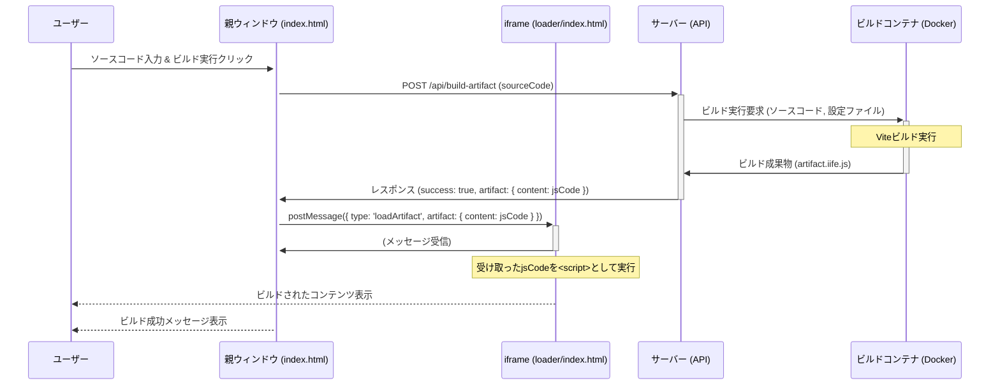

# オンデマンドビルドサービス デモサイト仕様

このドキュメントでは、オンデマンドビルドサービス デモサイトの基本的な動作シーケンスについて説明します。

## シーケンス図

## フロー概要

1.  **ユーザー操作:** ユーザーがテキストエリアに React コンポーネントのソースコードを入力し、「ビルド実行」ボタンをクリックします。
2.  **ビルドリクエスト:** 親ウィンドウ (`static/index.html`) は、入力されたソースコードをサーバーの `/api/build-artifact` エンドポイントに POST リクエストで送信します。
3.  **サーバー処理:**
    - サーバーはリクエストを受け取り、一時ディレクトリを作成します。
    - ソースコードとビルドに必要な設定ファイル（`package.json`, `vite.config.js` など）を一時ディレクトリに配置します。
    - Docker を使用してビルドコンテナ (`ondemand-build-service/builder`) を起動し、一時ディレクトリをマウントして Vite ビルドを実行させます。
4.  **ビルド実行:** ビルドコンテナ内で `vite build` が実行され、成果物として `dist/artifact.iife.js` が生成されます。
5.  **成果物返却:** サーバーはビルドコンテナから成果物ファイルの内容を読み取り、成功ステータスと JavaScript コードを含む JSON レスポンスを親ウィンドウに返します。
6.  **iframe への送信:** 親ウィンドウはサーバーからのレスポンスを受け取り、ビルドが成功していれば、成果物の JavaScript コードを `postMessage` を使用して iframe (`static/loader/index.html`) に送信します。
7.  **iframe での実行:** iframe は親ウィンドウからのメッセージを受け取ります。
    - 受け取った JavaScript コードを内容とする `<script>` 要素を動的に作成し、`document.body` に追加して実行します。
    - 実行された React コードが iframe 内の `
` にコンテンツを描画します。
8.  **結果表示:** ユーザーは iframe 内にビルドされたコンポーネントのプレビューを見ることができます。親ウィンドウにはビルド成功のステータスが表示されます。
