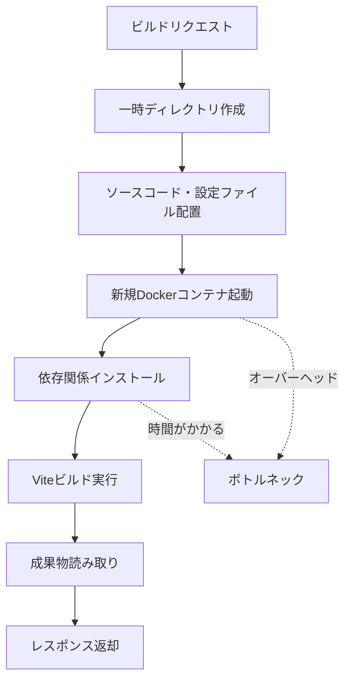
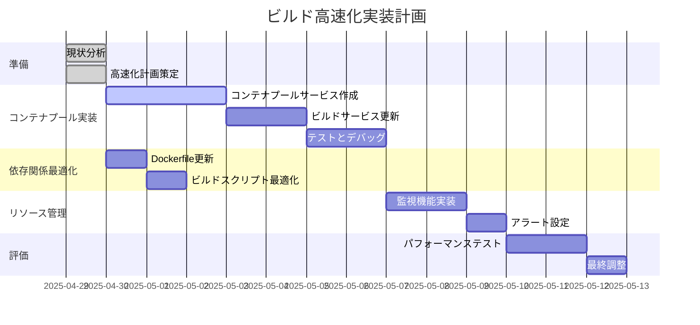

# コンテナプール中心のビルド高速化計画

## 概要

現在のオンデマンドビルドサービスでは、毎回のビルドリクエストで新しいDockerコンテナを起動し、依存関係のインストールからビルドまでを行っているため、ビルドが完了するまでに時間がかかっています。この計画では、コンテナプールの実装を中心に、ビルドプロセスを高速化する方法を提案します。

## 現状の課題



## 1. コンテナプール実装の詳細設計

```mermaid
flowchart TD
    Init[サーバー初期化] --> CreatePool[コンテナプール作成]
    CreatePool --> PreStartContainers[複数コンテナを事前起動]
    
    subgraph "コンテナプール管理"
        Monitor[コンテナ状態監視] --> CheckHealth[ヘルスチェック]
        CheckHealth --> |問題あり| Restart[コンテナ再起動]
        CheckHealth --> |問題なし| Continue[監視継続]
        Monitor --> CheckResources[リソース使用量確認]
        CheckResources --> |閾値超過| Recycle[コンテナ再作成]
    end
    
    Request[ビルドリクエスト] --> GetContainer[プールからコンテナ取得]
    GetContainer --> |利用可能| AssignContainer[コンテナ割り当て]
    GetContainer --> |すべて使用中| WaitOrCreate[待機または新規作成]
    
    AssignContainer --> CopyFiles[ファイルをコンテナにコピー]
    CopyFiles --> RunBuild[ビルドコマンド実行]
    RunBuild --> CopyResult[結果をコンテナからコピー]
    CopyResult --> ReleaseContainer[コンテナをプールに返却]
    
    ReleaseContainer --> CleanContainer[コンテナ内部クリーンアップ]
### 1.1 コンテナプールサービスの実装

```typescript
// src/container/containerPoolService.ts
import { spawn } from "child_process";
import { logger } from "../utils/logger";

interface ContainerInfo {
  id: string;
  busy: boolean;
  lastUsed: Date;
  createdAt: Date;
}

export class ContainerPoolService {
  private containers: ContainerInfo[] = [];
  private readonly poolSize: number;
  private readonly containerIdleTimeout: number; // ミリ秒
  private readonly maxMemoryUsage: number; // MB単位
  private readonly maxContainerAge: number; // ミリ秒単位
  private readonly healthCheckInterval: number; // ミリ秒単位
  private recycleCount: number = 0;

  constructor(
    poolSize = 3, 
    containerIdleTimeout = 300000, // 5分
    maxMemoryUsage = 500, // 500MB
    maxContainerAge = 3600000, // 1時間
    healthCheckInterval = 60000 // 1分
  ) {
    this.poolSize = poolSize;
    this.containerIdleTimeout = containerIdleTimeout;
    this.maxMemoryUsage = maxMemoryUsage;
    this.maxContainerAge = maxContainerAge;
    this.healthCheckInterval = healthCheckInterval;
  }

  async initialize(): Promise<void> {
    logger.info(`コンテナプールを初期化（サイズ: ${this.poolSize}）`);
    
    for (let i = 0; i < this.poolSize; i++) {
      try {
        const containerId = await this.startContainer();
        this.containers.push({
          id: containerId,
          busy: false,
          lastUsed: new Date(),
          createdAt: new Date()
        });
        logger.info(`コンテナ起動成功: ${containerId}`);
      } catch (error) {
        logger.error(`コンテナ起動エラー: ${error}`);
      }
    }
    
    // 定期的なヘルスチェックとリソース監視
    setInterval(() => this.monitorContainers(), this.healthCheckInterval);
    // 定期的にアイドル状態のコンテナをチェック
    setInterval(() => this.cleanupIdleContainers(), 60000);
  }

  private async startContainer(): Promise<string> {
    // Dockerコンテナを起動し、IDを返す
    const dockerCommand = "docker";
    const args = [
      "run",
      "-d",  // デタッチドモード
      "--rm",
      // メモリ制限
      "--memory", "512m",
      "--memory-swap", "512m",
      // CPU制限
      "--cpus", "0.5",
      // OOMスコア調整
      "--oom-score-adj", "500",
      // ヘルスチェック
      "--health-cmd", "pgrep node || exit 1",
      "--health-interval", "30s",
      "--health-timeout", "10s",
      "--health-retries", "3",
      // イメージ名
      "ondemand-build-service/builder:latest",
      // コンテナを起動したままにする
      "tail", "-f", "/dev/null"
    ];
    
    return new Promise<string>((resolve, reject) => {
      const process = spawn(dockerCommand, args);
      let stdout = "";
      let stderr = "";
      
      process.stdout.on("data", (data) => {
        stdout += data.toString().trim();
      });
      
      process.stderr.on("data", (data) => {
        stderr += data.toString();
      });
      
      process.on("close", (code) => {
        if (code === 0 && stdout) {
          resolve(stdout); // コンテナID
        } else {
          reject(stderr || `コンテナ起動エラー (コード: ${code})`);
        }
      });
    });
  }

  async getAvailableContainer(): Promise<string | null> {
    // 利用可能なコンテナを探す
    const availableContainer = this.containers.find(c => !c.busy);
    
    if (availableContainer) {
      availableContainer.busy = true;
      availableContainer.lastUsed = new Date();
      return availableContainer.id;
    }
    
    // 利用可能なコンテナがない場合は新しいコンテナを作成
    try {
      const containerId = await this.startContainer();
      this.containers.push({
        id: containerId,
        busy: true,
        lastUsed: new Date(),
        createdAt: new Date()
      });
      return containerId;
    } catch (error) {
      logger.error(`新規コンテナ起動エラー: ${error}`);
      return null;
    }
  }

  releaseContainer(containerId: string): void {
    // コンテナを解放（ビジー状態を解除）
    const container = this.containers.find(c => c.id === containerId);
    if (container) {
      container.busy = false;
      container.lastUsed = new Date();
    }
  }

  private async monitorContainers(): Promise<void> {
    logger.debug("コンテナの状態監視を実行中...");
    
    for (const container of this.containers) {
      try {
        // コンテナが生きているか確認
        const isRunning = await this.isContainerRunning(container.id);
        if (!isRunning) {
          logger.warn(`コンテナが停止しています: ${container.id}`);
          await this.recycleContainer(container);
          continue;
        }
        
        // メモリ使用量の確認
        const memoryUsage = await this.getContainerMemoryUsage(container.id);
        if (memoryUsage > this.maxMemoryUsage) {
          logger.warn(`コンテナのメモリ使用量が閾値を超えています: ${container.id} (${memoryUsage}MB)`);
          await this.recycleContainer(container);
          continue;
        }
        
        // コンテナの年齢確認
        const containerAge = new Date().getTime() - container.createdAt.getTime();
        if (containerAge > this.maxContainerAge) {
          logger.info(`コンテナの最大稼働時間を超えました: ${container.id}`);
          await this.recycleContainer(container);
          continue;
        }
      } catch (error) {
        logger.error(`コンテナ監視中にエラーが発生: ${container.id}`, error);
      }
    }
  }

  private async cleanupIdleContainers(): Promise<void> {
    const now = new Date();
    const containersToRemove: ContainerInfo[] = [];
    
    // アイドル状態が長いコンテナを特定
    this.containers.forEach(container => {
      if (!container.busy && 
          now.getTime() - container.lastUsed.getTime() > this.containerIdleTimeout) {
        containersToRemove.push(container);
      }
    });
    
    // 最低限のコンテナ数は維持
    const minContainersToKeep = Math.max(1, this.poolSize / 2);
    if (this.containers.length - containersToRemove.length < minContainersToKeep) {
      // 最も最近使用されたものから削除対象を減らす
      containersToRemove.sort((a, b) => 
        b.lastUsed.getTime() - a.lastUsed.getTime());
      containersToRemove.splice(0, 
        containersToRemove.length - (this.containers.length - minContainersToKeep));
    }
    
    // 不要なコンテナを停止
    for (const container of containersToRemove) {
      try {
        await this.stopContainer(container.id);
        this.containers = this.containers.filter(c => c.id !== container.id);
        logger.info(`アイドルコンテナを停止: ${container.id}`);
      } catch (error) {
        logger.error(`コンテナ停止エラー: ${error}`);
      }
    }
  }

  private async recycleContainer(container: ContainerInfo): Promise<void> {
    try {
      // コンテナが使用中でない場合のみリサイクル
      if (!container.busy) {
        await this.stopContainer(container.id);
        this.containers = this.containers.filter(c => c.id !== container.id);
        
        // 新しいコンテナを作成
        const newContainerId = await this.startContainer();
        this.containers.push({
          id: newContainerId,
          busy: false,
          lastUsed: new Date(),
          createdAt: new Date()
        });
        this.recycleCount++;
        logger.info(`コンテナをリサイクルしました: ${container.id} -> ${newContainerId}`);
      }
    } catch (error) {
      logger.error(`コンテナリサイクル中にエラーが発生: ${container.id}`, error);
    }
  }

  private async isContainerRunning(containerId: string): Promise<boolean> {
    const dockerCommand = "docker";
    const args = ["inspect", "--format", "{{.State.Running}}", containerId];
    
    return new Promise<boolean>((resolve) => {
      const process = spawn(dockerCommand, args);
      let stdout = "";
      
      process.stdout.on("data", (data) => {
        stdout += data.toString().trim();
      });
      
      process.on("close", (code) => {
        resolve(code === 0 && stdout === "true");
      });
    });
  }

  private async getContainerMemoryUsage(containerId: string): Promise<number> {
    const dockerCommand = "docker";
    const args = ["stats", "--no-stream", "--format", "{{.MemUsage}}", containerId];
    
    return new Promise<number>((resolve, reject) => {
      const process = spawn(dockerCommand, args);
      let stdout = "";
      
      process.stdout.on("data", (data) => {
        stdout += data.toString().trim();
      });
      
      process.on("close", (code) => {
        if (code === 0) {
          // 例: "10.5MiB / 1.952GiB" から数値を抽出
          const match = stdout.match(/(\d+(\.\d+)?)(MiB|GiB)/);
          if (match) {
            const value = parseFloat(match[1]);
            const unit = match[3];
            // MBに変換
            const memoryMB = unit === "GiB" ? value * 1024 : value;
            resolve(memoryMB);
          } else {
            resolve(0);
          }
        } else {
          resolve(0);
        }
      });
    });
  }

  private async stopContainer(containerId: string): Promise<void> {
    const dockerCommand = "docker";
    const args = ["stop", containerId];
    
    return new Promise<void>((resolve, reject) => {
      const process = spawn(dockerCommand, args);
      let stderr = "";
      
      process.stderr.on("data", (data) => {
        stderr += data.toString();
      });
      
      process.on("close", (code) => {
        if (code === 0) {
          resolve();
        } else {
          reject(stderr || `コンテナ停止エラー (コード: ${code})`);
        }
      });
    });
  }

  // コンテナ内部のクリーンアップ
  async cleanupContainer(containerId: string): Promise<void> {
    try {
      // コンテナ内の一時ファイルをクリーンアップ
      const commands = [
        "rm -rf /build/dist/*",
        "rm -rf /build/src/*",
        "rm -f /build/vite.config.js"
      ];
      
      for (const cmd of commands) {
        await this.executeInContainer(containerId, cmd);
      }
      
      logger.debug(`コンテナ内部をクリーンアップしました: ${containerId}`);
    } catch (error) {
      logger.warn(`コンテナクリーンアップ中にエラーが発生: ${containerId}`, error);
    }
  }

  async executeInContainer(containerId: string, command: string): Promise<string> {
    const dockerCommand = "docker";
    const args = ["exec", containerId, "sh", "-c", command];
    
    return new Promise<string>((resolve, reject) => {
      const process = spawn(dockerCommand, args);
      let stdout = "";
      let stderr = "";
      
      process.stdout.on("data", (data) => {
        stdout += data.toString();
      });
      
      process.stderr.on("data", (data) => {
        stderr += data.toString();
      });
      
      process.on("close", (code) => {
        if (code === 0) {
          resolve(stdout);
        } else {
          reject(stderr || `コマンド実行エラー (コード: ${code})`);
        }
      });
    });
  }

  getPoolStats() {
    const total = this.containers.length;
    const busy = this.containers.filter(c => c.busy).length;
    return {
      total,
      busy,
      available: total - busy,
      recycleCount: this.recycleCount
    };
  }
}

// シングルトンインスタンスをエクスポート
export const containerPoolService = new ContainerPoolService();
```
### 1.2 ビルドサービスの更新

```typescript
// src/build/buildService.ts の realBuild メソッドを更新
private async realBuild(buildDir: string): Promise<void> {
  logger.info(`ビルドを実行: ${buildDir}`);
  
  // コンテナプールから利用可能なコンテナを取得
  const containerId = await containerPoolService.getAvailableContainer();
  if (!containerId) {
    throw new Error("利用可能なコンテナがありません");
  }
  
  try {
    // コンテナ内部をクリーンアップ
    await containerPoolService.cleanupContainer(containerId);
    
    // ソースコードと設定ファイルをコンテナにコピー
    await this.copyFilesToContainer(containerId, buildDir);
    
    // コンテナ内でビルドコマンドを実行
    const buildOutput = await containerPoolService.executeInContainer(
      containerId, 
      "cd /build && npx vite build"
    );
    logger.debug(`ビルド出力: ${buildOutput}`);
    
    // ビルド成果物をコンテナからコピー
    await this.copyFilesFromContainer(containerId, buildDir);
    
    logger.info("ビルドが正常に完了しました");
  } catch (error) {
    logger.error(`ビルド実行エラー: ${error}`);
    throw error;
  } finally {
    // 処理完了後、コンテナをプールに返却
    containerPoolService.releaseContainer(containerId);
  }
}

private async copyFilesToContainer(containerId: string, buildDir: string): Promise<void> {
  const dockerCommand = "docker";
  
  // ソースコードをコピー
  const sourceCodePath = path.join(buildDir, "src", "main.jsx");
  const copySourceCmd = [
    "cp", 
    sourceCodePath, 
    `${containerId}:/build/src/main.jsx`
  ];
  
  // 設定ファイルをコピー
  const viteConfigPath = path.join(buildDir, "vite.config.js");
  const copyConfigCmd = [
    "cp", 
    viteConfigPath, 
    `${containerId}:/build/vite.config.js`
  ];
  
  try {
    await this.execCommand(dockerCommand, copySourceCmd);
    await this.execCommand(dockerCommand, copyConfigCmd);
    logger.debug(`ファイルをコンテナにコピーしました: ${containerId}`);
  } catch (error) {
    throw new Error(`ファイルコピーエラー: ${error}`);
  }
}

private async copyFilesFromContainer(containerId: string, buildDir: string): Promise<void> {
  const dockerCommand = "docker";
  const outputDir = path.join(buildDir, "dist");
  
  // 出力ディレクトリが存在することを確認
  await fs.mkdir(outputDir, { recursive: true });
  
  // 成果物をコンテナからコピー
  const copyCmd = [
    "cp", 
    `${containerId}:/build/dist/artifact.iife.js`, 
    path.join(outputDir, "artifact.iife.js")
  ];
  
  try {
    await this.execCommand(dockerCommand, copyCmd);
    logger.debug(`成果物をコンテナからコピーしました: ${containerId}`);
  } catch (error) {
    throw new Error(`成果物コピーエラー: ${error}`);
  }
}

private async execCommand(command: string, args: string[]): Promise<string> {
  return new Promise<string>((resolve, reject) => {
    const process = spawn(command, args);
    let stdout = "";
    let stderr = "";
    
    process.stdout.on("data", (data) => {
      stdout += data.toString();
    });
    
    process.stderr.on("data", (data) => {
      stderr += data.toString();
    });
    
    process.on("close", (code) => {
      if (code === 0) {
        resolve(stdout);
      } else {
        reject(stderr || `コマンド実行エラー (コード: ${code})`);
      }
    });
  });
}
```

## 2. 依存関係の事前インストール（補完的対策）

コンテナプールと組み合わせて、依存関係を事前インストールすることで、さらなる高速化が期待できます。

### 2.1 最適化されたDockerfile

```dockerfile
FROM node:20-alpine

# アプリケーションディレクトリの設定
WORKDIR /app

# 依存関係を事前インストール
COPY package.json ./
RUN npm install -g vite@4.3.9 @vitejs/plugin-react@4.0.0
RUN npm install react@18.2.0 react-dom@18.2.0

# ビルド用のディレクトリ構造を事前に作成
RUN mkdir -p /build/src /build/dist

# クリーンアップスクリプトの追加
COPY cleanup.sh /usr/local/bin/
RUN chmod +x /usr/local/bin/cleanup.sh

# ビルドスクリプトのコピーと実行権限の付与
COPY build.sh /usr/local/bin/
RUN chmod +x /usr/local/bin/build.sh

# ビルドディレクトリの設定
WORKDIR /build

# コンテナ起動時のデフォルトコマンド（コンテナプール用）
CMD ["tail", "-f", "/dev/null"]
```

### 2.2 クリーンアップスクリプト

```bash
#!/bin/sh
# cleanup.sh - コンテナ内部のクリーンアップ用スクリプト

# ビルド成果物のクリーンアップ
rm -rf /build/dist/*

# ソースコードのクリーンアップ
rm -rf /build/src/*

# 設定ファイルのクリーンアップ
rm -f /build/vite.config.js

echo "コンテナ内部をクリーンアップしました"
```

### 2.3 最適化されたビルドスクリプト

```bash
#!/bin/sh
# build.sh - ビルド実行スクリプト
set -e

echo "Viteビルドを開始します..."

# ソースコードの確認
if [ ! -f "/build/src/main.jsx" ]; then
  echo "エラー: ソースコードファイル(/build/src/main.jsx)が見つかりません"
  exit 1
fi

# 設定ファイルの確認
if [ ! -f "/build/vite.config.js" ]; then
  echo "エラー: Vite設定ファイル(/build/vite.config.js)が見つかりません"
  exit 1
fi

# ビルドの実行（依存関係インストールをスキップ）
echo "Viteビルドを実行中..."
npx vite build

# ビルド結果の確認
if [ ! -f "/build/dist/artifact.iife.js" ]; then
  echo "エラー: ビルド成果物(/build/dist/artifact.iife.js)が生成されませんでした"
  exit 1
fi

echo "Viteビルドが正常に完了しました"
exit 0
```
## 3. サーバー初期化コードの更新

```typescript
// src/index.ts
import express from "express";
import bodyParser from "body-parser";
import cors from "cors";
import dotenv from "dotenv";
import path from "path";
import { buildRouter } from "./api/buildRouter";
import { logger } from "./utils/logger";
import { containerPoolService } from "./container/containerPoolService";

// 環境変数のロード
dotenv.config();

const app = express();
const PORT = process.env.PORT || 3700;

// ミドルウェアの設定
app.use(cors());
app.use(bodyParser.json({ limit: "10mb" }));
app.use(express.static(path.join(__dirname, "../static")));

// ルーターの設定
app.use("/api", buildRouter);

// 基本的なルート
app.get("/", (req, res) => {
  res.send("オンデマンドビルドサービス API サーバー");
});

// コンテナプールの状態を返すエンドポイント
app.get("/api/pool-status", (req, res) => {
  res.json(containerPoolService.getPoolStats());
});

// サーバー起動前にコンテナプールを初期化
async function initializeServer() {
  logger.info("サーバーの初期化を開始します...");
  
  try {
    // コンテナプールの初期化
    await containerPoolService.initialize();
    logger.info("コンテナプールの初期化が完了しました");
    
    // モニタリングの開始
    startMonitoring();
    
    // サーバーの起動
    app.listen(PORT, () => {
      logger.info(`サーバーが起動しました: http://localhost:${PORT}`);
      logger.info("コンテナプールを使用してViteビルドを実行します");
    });
  } catch (error) {
    logger.error("サーバー初期化中にエラーが発生しました:", error);
    process.exit(1);
  }
}

// モニタリング機能
function startMonitoring() {
  // コンテナプールの状態を定期的にログ
  setInterval(() => {
    const stats = containerPoolService.getPoolStats();
    logger.info(`コンテナプール状態: 総数=${stats.total}, 使用中=${stats.busy}, 利用可能=${stats.available}, リサイクル=${stats.recycleCount}`);
  }, 60000);
}

// サーバーの初期化と起動
initializeServer().catch(err => {
  logger.error("サーバー起動中に致命的なエラーが発生しました:", err);
  process.exit(1);
});
```

## 4. リスク対策

| リスク | 対策 |
|-------|------|
| メモリリーク | コンテナの定期的なリサイクル、メモリ使用量の監視、最大稼働時間の設定 |
| コンテナ障害 | ヘルスチェックによる自動検出と再起動、冗長なプールサイズ |
| ビルド失敗 | タイムアウト設定、エラーハンドリングの強化、詳細なログ出力 |
| リソース競合 | コンテナごとのリソース制限、負荷分散、動的なプールサイズ調整 |
| ファイル残存 | コンテナ返却時の確実なクリーンアップ処理 |

## 5. 実装計画とタイムライン



## 6. 期待される効果

- **ビルド時間**: 現在の30-60秒から5-10秒へ（約80-90%の削減）
- **スケーラビリティ**: 同時ビルドリクエスト処理能力の向上
- **リソース効率**: サーバーリソースの効率的な利用
- **安定性**: 長時間稼働による問題の軽減

## 7. 設定パラメータの調整ガイド

コンテナプールの設定は、システムの負荷やリソース状況に応じて調整することが重要です。以下のパラメータを環境に合わせて調整してください：

- **プールサイズ**: 同時ビルドリクエスト数の予測に基づいて設定（デフォルト: 3）
- **コンテナアイドルタイムアウト**: 未使用コンテナを保持する時間（デフォルト: 5分）
- **最大メモリ使用量**: コンテナのメモリ使用量の閾値（デフォルト: 500MB）
- **最大コンテナ稼働時間**: コンテナを再作成するまでの時間（デフォルト: 1時間）
- **ヘルスチェック間隔**: コンテナの状態を確認する頻度（デフォルト: 1分）

これらのパラメータは、`containerPoolService`のコンストラクタで設定できます。

## 8. まとめ

この高速化計画では、コンテナプールの実装を中心に、依存関係の事前インストールとリソース管理の強化を組み合わせることで、ビルドプロセスの大幅な高速化と安定性の向上を目指します。特に、毎回のビルドリクエストで新しいコンテナを起動し、依存関係をインストールする必要がなくなるため、ビルド時間を大幅に短縮できます。

また、長時間稼働するコンテナのメモリリークやリソース管理の問題に対処するための仕組みも組み込まれており、システムの安定性も向上します。

この計画を実装することで、ユーザー体験の向上とシステムリソースの効率的な利用が期待できます。